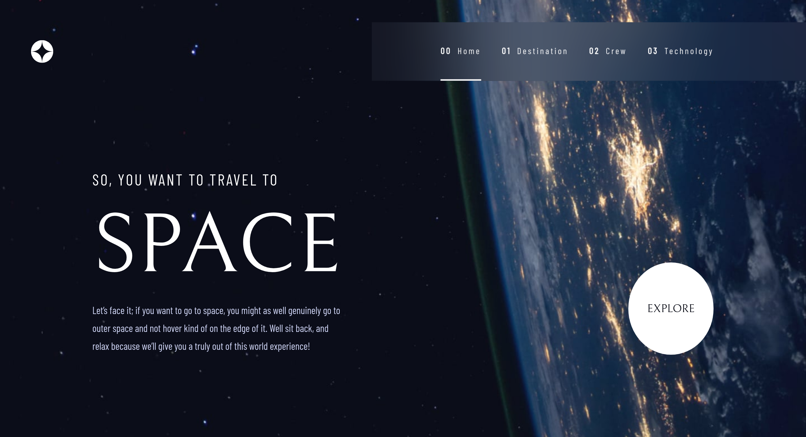
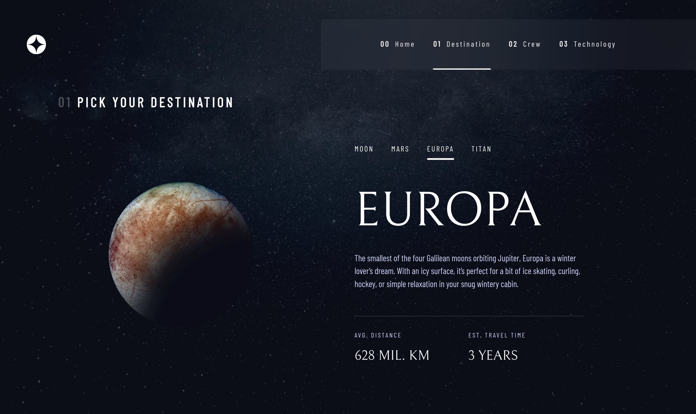
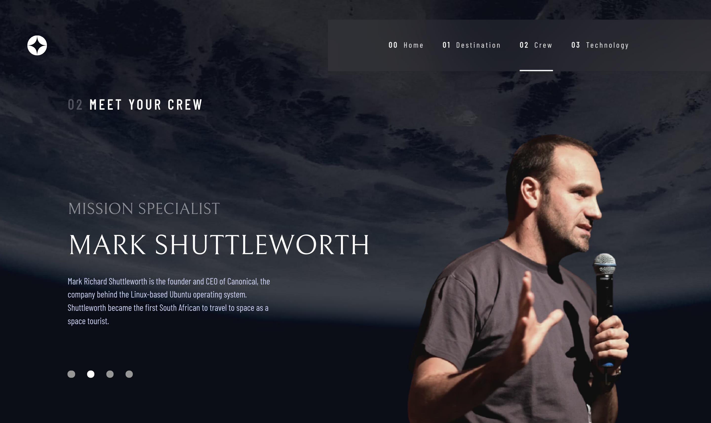

# Frontend Mentor - Space tourism website solution

This is a solution to the [Space tourism website challenge on Frontend Mentor](https://www.frontendmentor.io/challenges/space-tourism-multipage-website-gRWj1URZ3). Frontend Mentor challenges help you improve your coding skills by building realistic projects.

## Table of contents

- [Overview](#overview)
  - [The challenge](#the-challenge)
  - [Screenshot](#screenshot)
  - [Links](#links)
- [My process](#my-process)
  - [Built with](#built-with)
- [Author](#author)

**Note: Delete this note and update the table of contents based on what sections you keep.**

## Overview

### The challenge

Users should be able to:

- View the optimal layout for each of the website's pages depending on their device's screen size
- See hover states for all interactive elements on the page
- View each page and be able to toggle between the tabs to see new information

### Screenshot

### Links

- Solution URL: [https://github.com/asimbera/spacetourism](https://github.com/asimbera/spacetourism)
- Live Site URL: [https://space-tourism-prod.pages.dev/](https://space-tourism-prod.pages.dev/)

## My process

### Built with

- Semantic HTML5 markup
- CSS custom properties
- Flexbox
- CSS Grid
- Mobile-first workflow
- [React](https://reactjs.org/) - JS library
- [Emotion](https://emotion.sh/) - For styles
- [Framer Motion](https://www.framer.com/docs/introduction/) - Animation library for react
- [Vite](https://vitejs.dev/) - Javascript bundler

## Author

- Website - [asimbera.github.io](https://asimbera.github.io/)
- Frontend Mentor - [@asimbera](https://www.frontendmentor.io/profile/asimbera)
- Twitter - [@asimbera\_](https://www.twitter.com/asimbera_)
